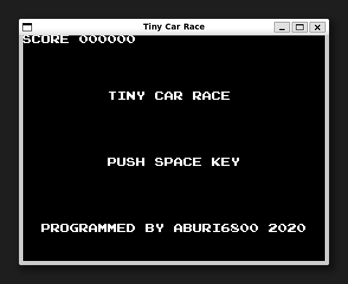

[ [Engligh](README.md) | [日本語](README_ja.md) ]

---

# TinyCarRace



## Overview

A retro-like car racing game made with python and tkinter.

## Requirements

* Python 3.5 Leter.  
* Pillow 7.0 Leter.  

The installation of Pillow compatible with the Python version is done below:  
```
$ python -m pip install --upgrade pip
$ python -m pip install --upgrade Pillow
```

> See below for Pillow installation.  
> <https://pillow.readthedocs.io/en/latest/installation.html>

## Running the game

For the first time only, clone the git repository.
```
$ git clone https://github.com/aburi6800/Python-TinyCarRace.git
```

Execute the following command.
```
$ cd Python-TinyCarRace
$ python racing.py
```

> For Linux, use the `python3` command instead of the `python` command,  
> or install the `python-is-python3` package.  
> ```
> $ sudo apt install python-is-python3
> ```

## How to play


- Maneuver the car so that it does not leave the course.  
- As the game progresses, other cars will appear.  
- The game is over when the car leaves the course or hits another car.  

## Controls

|key|Description|
| --- | --- |
|left cursor key|Move left|
|right cursor key|Move right|
|space key|Start Game|

## Authors
Hitoshi Iwai(aburi6800)

## License
MIT License
