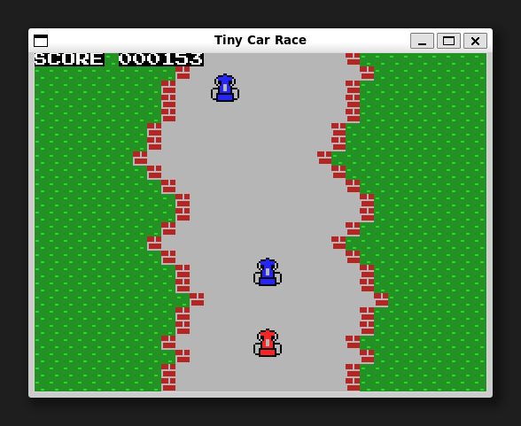

[ [Engligh](README.md) | [日本語](README_ja.md) ]

---

# TinyCarRace


## 概要

pythonとtkinterで作った、レトロ風カーレースゲームです。  

## Requirements

* Python 3.5 以降  
* Pillow 7.0 以降  

お使いのPythonのバージョンに対応したPillowのインストールは、以下のように行います:  
```
$ python -m pip install --upgrade pip
$ python -m pip install --upgrade Pillow
```

> Pillowのインストールについては下記を参照ください。  
> <https://pillow.readthedocs.io/en/latest/installation.html>

## ゲームの実行

初回のみ、gitリポジトリのクローンを作成します。  
```
$ git clone https://github.com/aburi6800/Python-TinyCarRace.git
```

次のコマンドを実行します。  
```
$ cd Python-TinyCarRace
$ python racing.py
```

> Linuxの場合は、`python` コマンドの代わりに `python3` コマンドを使用します。  
> または `python-is-python3` パッケージをインストールしてください。  
> ```
> $ sudo apt install python-is-python3
> ```

## How to play



- コースから外れないように操作してください。  
- ゲームが進むと、他の車も登場します。  
- コースから外れるか、他の車にぶつかるとゲームオーバーです。  

## 操作方法

|key|Description|
| --- | --- |
|左カーソルキー|左に移動|
|右カーソルキー|右に移動|
|スペースキー|ゲームスタート|

## 作者
Hitoshi Iwai(aburi6800)

## ライセンス
MIT License
